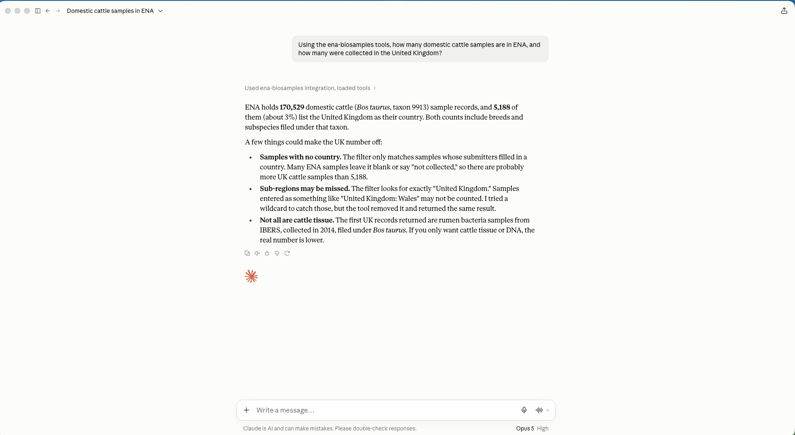
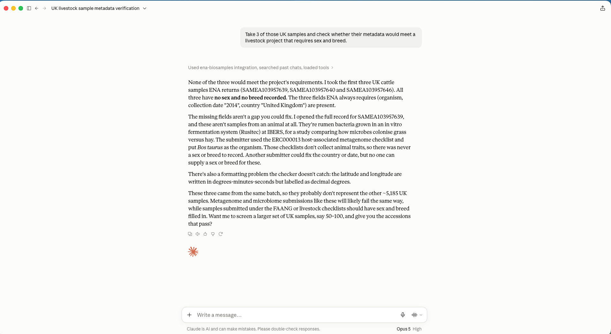

# ena-biosamples-mcp

[](https://github.com/Abinesh-T/ena-biosamples-mcp/actions/workflows/ci.yml)

An [MCP](https://modelcontextprotocol.io) server that lets researchers ask questions about public
genomics data in the [European Nucleotide Archive (ENA)](https://www.ebi.ac.uk/ena) and
[BioSamples](https://www.ebi.ac.uk/biosamples) in plain English, from any MCP client
(Claude, IDE agents, custom agents).

**Question in, insight out:** "How many domestic cattle samples were collected in the UK, and is
their metadata good enough for a livestock project?" becomes a handful of API calls and a
checked, explained answer.

## Demo

**1. Counting records with a country filter**



**2. Checking metadata against a livestock project's requirements**



The second check found a real data-quality issue: the first UK "cattle" samples are rumen
bacteria from an in vitro fermentation study, submitted under a metagenome checklist, so they
can never carry sex or breed. Their coordinates are also written in degrees-minutes-seconds
while labelled as decimal degrees.

## Tools

| Tool | Example question | Source |
|---|---|---|
| `count_records` | "How many cattle sequencing runs are in ENA?" | ENA Portal API |
| `search_samples` | "Show me cattle samples collected in the United Kingdom" | ENA Portal API |
| `get_biosample` | "What tissue and breed is sample SAMEA103957639?" | BioSamples API |
| `check_sample_metadata` | "Does this sample have sex and breed for a FAANG-style project?" | BioSamples API |

`check_sample_metadata` always checks the fields ENA requires on every sample (organism,
collection date, geographic location) and accepts extra required fields per project. Each field is
reported as `ok`, `absent`, `declared_missing` (an INSDC missing-value term such as
"not collected") or `invalid_format` (e.g. a collection date that isn't ISO 8601).

## Quick start

### Claude desktop app (stdio)

Requires [uv](https://docs.astral.sh/uv/). Add to the MCP config and restart the app:

```json
{
  "mcpServers": {
    "ena-biosamples": {
      "command": "/full/path/to/uv",
      "args": ["--directory", "/path/to/ena-biosamples-mcp", "run", "ena-mcp"]
    }
  }
}
```

### Docker (Streamable HTTP)

```bash
docker build -t ena-biosamples-mcp .
docker run --rm -p 8000:8000 ena-biosamples-mcp
# MCP endpoint: http://localhost:8000/mcp
```

### Development

```bash
uv sync
uv run pytest                          # unit tests, no network
uv run ruff check .
uv run python scripts/smoke_live.py    # live check against ENA and BioSamples
```

Settings can be overridden with `ENA_MCP_*` environment variables; see `.env.example`.

## Design notes

- **Service layer.** All HTTP calls live in `ena_service.py` and `biosamples_service.py`. MCP
  tools in `server.py` only delegate, and tests swap in a mock transport.
- **Metadata rules are pure functions** (`metadata_check.py`), so consortium-specific rules can
  be added and tested without touching the network.
- **Verified against the live APIs**, not just the docs. Findings that shaped the code:
  - The ENA count endpoint returns TSV with a header line, not a bare number.
  - `country="United Kingdom*"` returns 0 results while `country="United Kingdom"` returns
    5,188, so countries are matched exactly (case-insensitive). `country="*Kingdom*"` returns the
    same 5,188, so no region-suffixed UK values are missed.
  - "cattle" resolves to the genus *Bos*, which also covers yak and zebu. Results carry a note
    telling the client to ask for a species such as *Bos taurus*.
- **Clear errors.** Unknown species, private samples and wrong accession types come back as
  readable messages the model can relay to the user.

## Roadmap

- Validate coordinates (decimal degrees vs. degrees-minutes-seconds), found during the demo
- Check samples against full ENA and consortium checklists (e.g. FAANG, ERGA)
- Aggregate tools, e.g. samples per country or per year for a species
- Response caching and polite rate limiting for bulk questions

## License

MIT
